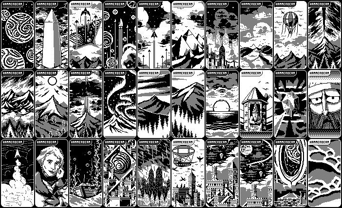
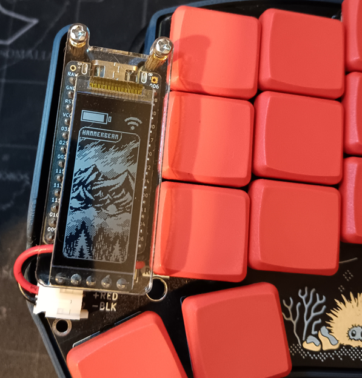

# Hammerbeam Slideshow
## NOTE ABOUT FORK
This fork replaces the original lv_animimg-based art rotation with a battery-safe k_work_delayable system using the Zephyr workqueue.
The original animation widget caused memory corruption or stopped working with long intervals (≥5 min), likely due to LVGL timer issues on e-paper displays. Additionally, the slideshow is now randomized (Fisher-Yates) with no repeats until a full cycle has been displayed. The delay is configurable slideshow delay via ART_ROTATE_INTERVAL (default = 10 minutes), which can be refactored to use the original var that allows you to set the interval (`CONFIG_CUSTOM_ANIMATION_SPEED`). I just prefer it this way 8). The "patch" lives in peripheral_status.c.

## Original README from GPEYE
"This is a zmk module to implement a slideshow of 30 of Hammerbeam's 1 bit art on the peripheral (right) nice!view display.

Hammerbeam, _the original artist of the iconic balloon and mountain art found in the default zmk firmware for the nice!view screen_, has more fantastic 1 bit art that you may not have seen.

With Hammerbeam's consent, he allowed me use what I wanted of his public posts of his 1-bit art and format them as necessary to bring more of his work to the nice!view display. I made sure to keep his signature in each picture for attribution so others can find more of his work.

The picture to be displayed by this module on the peripheral screen will be one of these 30 and will change every 10 seconds.




## Usage

To use this module, first add it to your config/west.yml by adding a new entry to remotes and projects:

```yml
manifest:
  remotes:
      # zmk official
    - name: zmkfirmware
      url-base: https://github.com/zmkfirmware
    - name: gpeye                         #new entry
      url-base: https://github.com/GPeye  #new entry
  projects:
    - name: zmk
      remote: zmkfirmware
      revision: main
      import: app/west.yml
    - name: hammerbeam-slideshow          #new entry
      remote: gpeye                       #new entry
      revision: main                      #new entry
  self:
    path: config
```

Now simply swap out the default nice_view shield on the board for the custom one in your build.yaml file.

```yml
---
include:
  - board: nice_nano_v2
    shield: urchin_left nice_view_adapter  nice_view
  - board: nice_nano_v2
    shield: urchin_right nice_view_adapter nice_view_custom #custom shield
```
```
